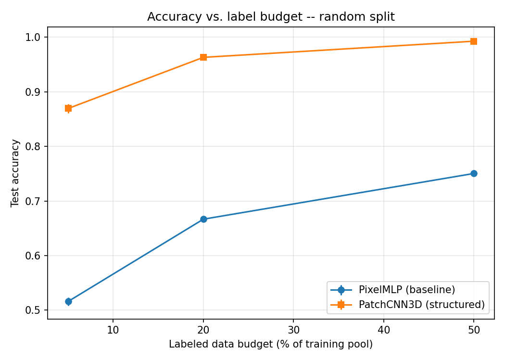
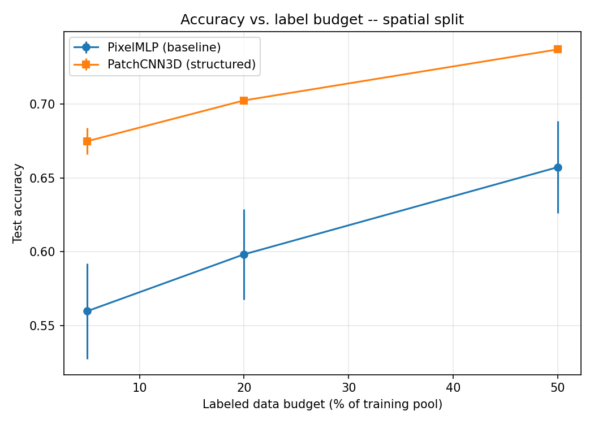

# Hyperspectral Structured-Representation CV Benchmark

**Research domain:** Structured vs. unstructured representations for hyperspectral image classification under limited labeled data regimes.

**Status:** Fully built and evaluated end-to-end on real data. Every metric in this repository is derived from actual completed training runs — see [Results](#results).

## Overview

This repository presents an empirical benchmark evaluating whether treating hyperspectral pixels as structured spatial-neighborhood representations captures critical information lost by traditional per-pixel (unstructured) signatures — **specifically under limited labeled data constraints.**

Two distinct PyTorch architectures are trained on the **Indian Pines** benchmark dataset and compared across three labeled-data budgets (5%, 20%, and 50%):

- **`PixelMLP`** — Evaluates only a single pixel's 1D spectral signature (the unstructured spectral baseline).
- **`PatchCNN3D`** — Processes a 9×9 spatial neighborhood surrounding the target pixel as a 3D convolution over `(spectral, height, width)` (the structured spatial-spectral model).

Both models share identical spectral preprocessing (per-band standardization + PCA reduction to 30 components), isolating spatial neighborhood context as the sole experimental variable.

## Methodological Finding & Spatial Leakage Analysis

**Headline Result:** The structured spatial-spectral model outperforms the baseline across all labeled-data budgets, and its relative advantage increases as labeled training data becomes scarce.

**Methodological Twist:** Standard Hyperspectral Image (HSI) benchmarks often rely on random per-pixel train/test splits, which allow test patches to spatially overlap with neighboring training pixels (as noted by Nalepa et al., 2019, *"Validating Hyperspectral Image Segmentation"*). To quantify this spatial data leakage, this benchmark evaluates both architectures under **two distinct splitting strategies**:

1. **Random Stratified Split** (Standard Practice) — Pixels are assigned to train/test sets independently at random.
2. **Spatial-Block Split** (Fairness Check) — The image is partitioned into 15×15 spatial tiles, ensuring whole spatial regions remain strictly in either the training or test set.

## Results

All reported metrics represent mean test accuracy across 2 random seeds (15 training epochs) on a fixed held-out test set.

### 1. Random Split (Standard Benchmark Practice)

| Label Budget | PixelMLP (Baseline) | PatchCNN3D (Structured) | Structured Advantage |
|---|---|---|---|
| 5%  | 51.6% | 86.9% | **+35.3 pts** |
| 20% | 66.7% | 96.3% | **+29.6 pts** |
| 50% | 75.0% | 99.3% | **+24.2 pts** |

### 2. Spatial-Block Split (Strict Disjoint Split)

| Label Budget | PixelMLP (Baseline) | PatchCNN3D (Structured) | Structured Advantage |
|---|---|---|---|
| 5%  | 56.0% | 67.5% | **+11.5 pts** |
| 20% | 59.8% | 70.3% | **+10.4 pts** |
| 50% | 65.7% | 73.7% | **+8.0 pts** |




### Key Takeaways

1. **Structured representations remain superior under strict splits:** Under both splitting strategies, spatial context improves performance at every data budget, with gains scaling inversely with available training labels (5% → 20% → 50%).
2. **Random splits inflate structured advantage (~3x):** The spatial patch model shows a +24 to +35 point boost under random splitting, but a +8 to +12 point boost under strict spatial block splitting.
3. **Asymmetric sensitivity to spatial leakage:** Removing overlap drops `PatchCNN3D` accuracy significantly (96.3% → 70.3% at 20% budget), whereas `PixelMLP` remains relatively stable (66.7% → 59.8%).

Full raw metrics across all seeds are available in `results/budget_ablation_random.json` and `results/budget_ablation_spatial.json`.

## Data

**Indian Pines HSI Dataset** — 145×145 spatial resolution, 200 spectral bands (after removing water-absorption bands), 16 land-cover ground truth classes (10,249 total labeled pixels). 

Data loading (`src/data.py`) handles automated fetching, shape validation, per-band standardization, and PCA transformation.

## Tech Stack

| Component | Choice | Rationale |
|---|---|---|
| **Data** | Indian Pines (`.mat`, `scipy.io`) | Standard benchmark for HSI land-cover classification |
| **Preprocessing** | Standardization + PCA (30 components) | Reduces spectral dimensionality while preserving band variance across models |
| **Baseline Model** | PyTorch 1D MLP | Unstructured spectral reference point |
| **Structured Model** | PyTorch 3D-CNN | Joint spatial-spectral neighborhood representation |
| **Splitting Engine** | Stratified Random + Spatial-Block | Benchmark evaluation for spatial data leakage |
| **Testing** | `pytest` (15 test suites) | Verifies tensor dimensions, split isolation, and gradient flows |

## Repo Structure

```
src/
  data.py       # Download, standardization, PCA, patch extraction, spatial splits
  models.py     # PixelMLP (baseline) and PatchCNN3D (structured) architectures
  train.py      # Unified PyTorch training and validation pipeline
experiments/
  eda.py                    # Class distribution and spectral signature analysis
  run_budget_ablation.py    # Main experiment runner for label budget ablations
tests/
  test_data.py    # Unit tests for preprocessing and split partitioning
  test_models.py  # Unit tests for forward pass and gradient flow
results/          # Serialized ablation JSON outputs
figures/          # Generated accuracy plots and spectral visualizations
```

## How to Run

```bash
pip install -r requirements.txt

# Run unit tests
python -m pytest tests/ -v

# Generate EDA plots -> figures/
python experiments/eda.py

# Run ablation experiments across budgets and seeds
python experiments/run_budget_ablation.py --split random  --budgets 0.05,0.2,0.5 --seeds 0,1
python experiments/run_budget_ablation.py --split spatial --budgets 0.05,0.2,0.5 --seeds 0,1
```

Runs efficiently on CPU in under an hour; automatically utilizes GPU (`cuda`) when available.

## Future Extensions

- **Extended Random Seeds:** Expanding beyond 2 seeds for tighter confidence bounds across low-budget regimes.
- **Graph Neural Networks (GNNs):** Superpixel graph representations to capture irregular spatial topologies beyond rectangular patch windows.
- **Spatial Buffer Margins:** Incorporating buffer zones between spatial block tiles to completely eliminate boundary patch overlap.
